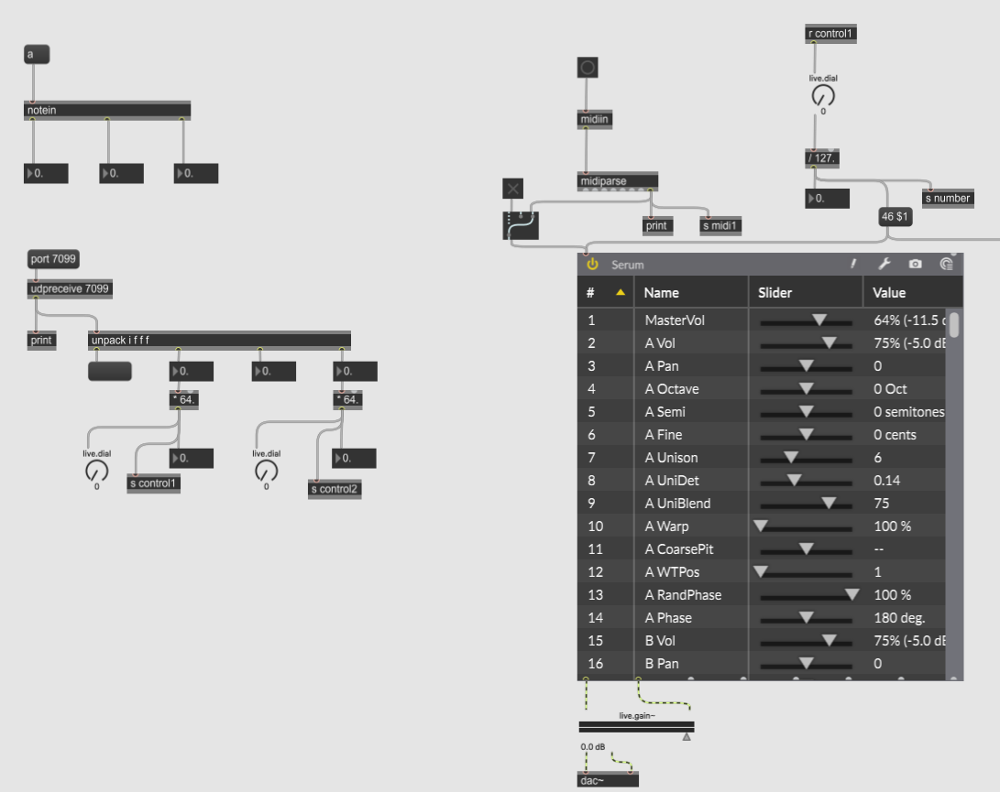
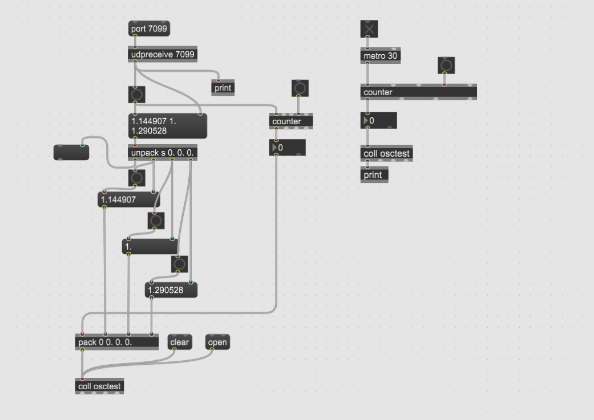

# Echo

在AR中探索肢体交互、图像视觉和声音合成的关系

***“Echo”（暂用名）是由中国美术学院创新设计学院媒介与交互研究所学生进行并在Github同步更新进度的数字媒体艺术项目***
***详细技术解决方案见此处***

## 我们要做什么
我们希望做出一套系统，使得戴上AR眼镜的你/你们可以共同看见你们之间的微妙联系，听见你们之间的空间所发出的声音，你的动作会实时改变AR中的视觉元素，当你用你的动作改变这一微妙联系之时，空间所发出的声音也会因此改变。
这意味着，我们需要实时读取使用者的肢体信息，利用其创作出AR空间中的视觉元素并随着肢体信息改变而改变，同时利用肢体信息进行声音设计以及实时的声音合成，再将这些赋予使用者的设备。

###### ——————该branch建于2023/12/8，此前产生的技术解决方案记录于下——————

⚪声音合成
我们使用Max进行osc信号的接收以及预处理，将Serum合成器作为VST插件植入Patcher，便可使用实时接收到的osc信号进行声音的合成。

###### ——————2023/12/8——————
今天我们试图解决

 1. 获取使用者的动作信息并将信息本身打包保存，以供在unity中复现该动作。（已解决）

针对该需求，需要首先记录osc信号，并能够播放被存储的信号。这些都能在Max中实现。
在Max中实现Patcher如下。

###### ——————2023/12/9——————
今天我们试图解决

 1. 实时捕捉使用者的肢体动作信息并以osc信号形式发送。（已解决）

针对该需求，需要首先捕捉人体动作，再实时发送给接收器（Max）。捕捉人体动作可以使用[Unity AR Foundation中的Body Tracking](https://github.com/Unity-Technologies/arfoundation-samples#body-tracking)功能，动作信息的发送则需要在骨骼上使用osc信号发送插件（这里我们使用的是[OSC Jack](https://github.com/keijiro/OscJack)）
效果如下。

###### ——————2023/12/9——————
今天我们试图解决

 1. 实时捕捉使用者的肢体动作信息并以osc信号形式发送。

